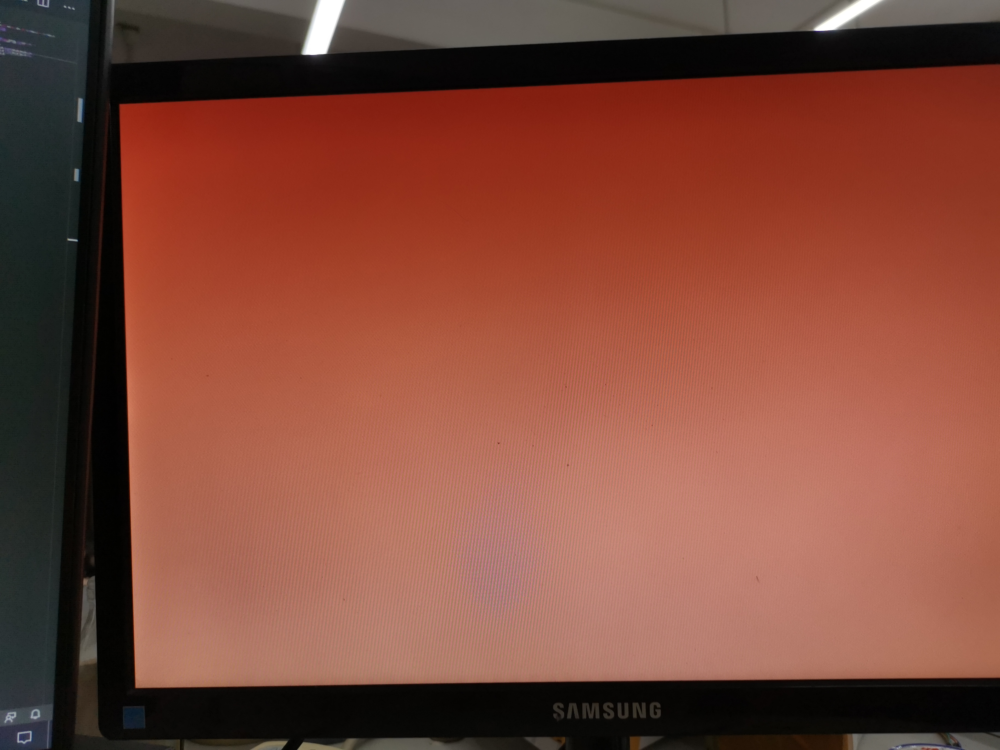
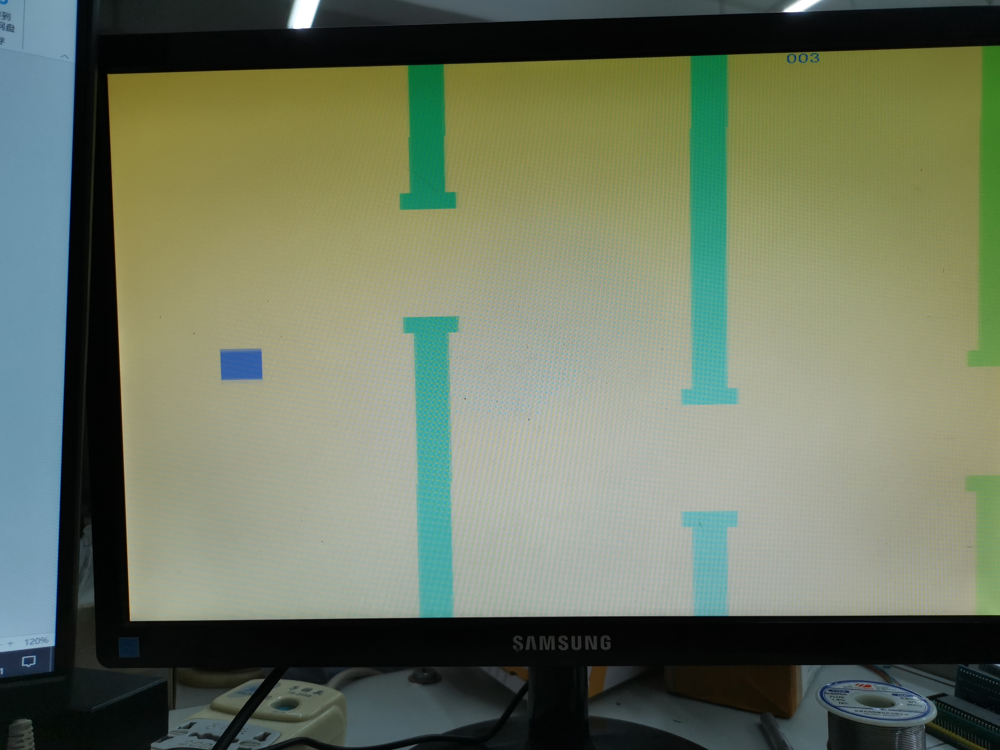

# Flappy Bird
---
## 项目概要
本设计主要进行了游戏Flappy Bird 的复刻，在FPGA上用硬件电路的逻辑实现了这个游戏的基本操作与玩法。在这个工程中学习了HDMI的信号的输出，图形显示，伪随机数的生成，按键的消抖与检测，游戏的基本逻辑判定，ROM核的使用，字模的生成与显示等。本设计中涉及到的FPGA相关代码，可以在修改后作为一个项目的最终输出端，实现图形界面的直观显示，以及人机交互。复刻的游戏展示了图形界面展示与人机交互的可能性。

---
## 使用的工具版本
**开发平台：**  Vivado2019.1

---
## 小组成员列表

|学号|姓名|
|:---|:---|
|2018112844|**Jzq**|

---

## 板卡型号与外设列表

 **板卡型号：**  SEA-Board （板载**xc7s15ftgb196-1**与**ESP32**）

**外设列表：** VGA显示器、miniHDMI转VGA接口

---

## 仓库目录介绍
---

-  source:存放FPGA源码
- ExecutableFiles: 本⽬录存放可直接下载到板卡使⽤的FPGA 比特流文件
- images:项目照片
- videos:演示视频

---

## 作品照片

---

---